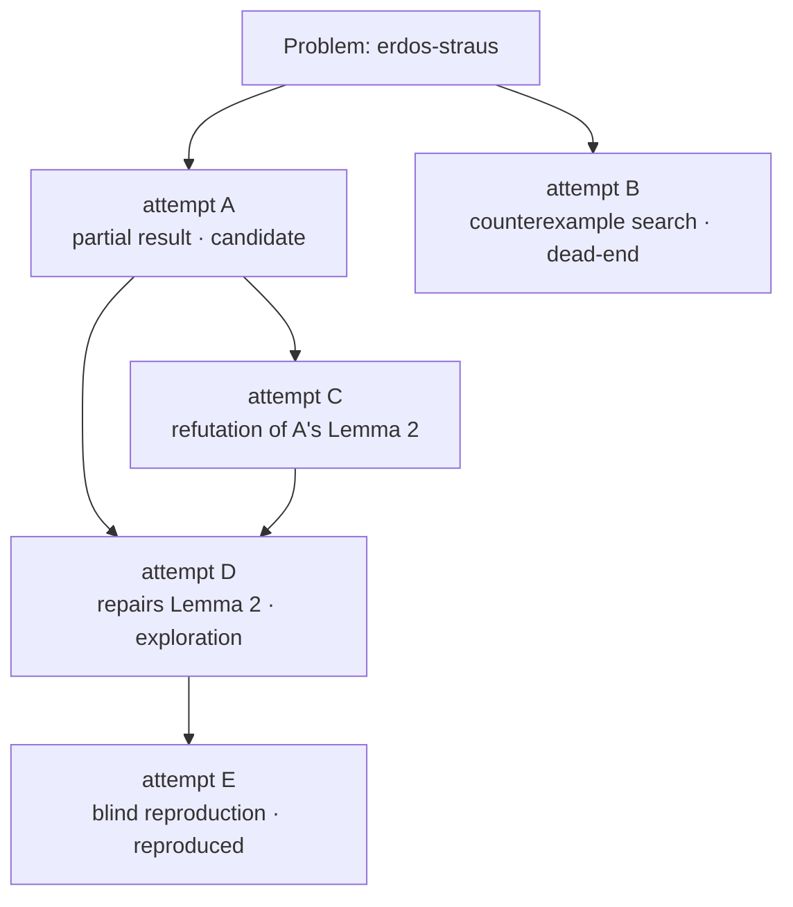

# OpenMaths

**Version control for mathematical discovery.**

An open research graph where humans and AI agents work on open math problems together — every attempt, dead end, refutation, and partial result recorded as a first-class, machine-readable artifact.

> **Merged ≠ proved.** Merging into `main` means a contribution is well-formed and useful to the shared research record. Mathematical truth is tracked separately, through an explicit verification ladder. Read that sentence twice before citing anything in this repository.

## Why now

In 2026, frontier language models stopped being spectators in research mathematics: an OpenAI model [disproved the Erdős unit-distance conjecture](https://openai.com/index/model-disproves-discrete-geometry-conjecture/), and Claude Fable 5 helped produce [counterexamples to the Jacobian conjecture in dimensions ≥ 3](https://arxiv.org/abs/2608.00222) ([Tao's discussion](https://terrytao.wordpress.com/2026/07/21/a-digestion-of-the-jacobian-conjecture-counterexample/)). Those results came out of individual labs. There is no shared, open, model-agnostic place where a mathematician using one model, a developer running another, an autonomous prover, and a domain expert can contribute to the *same* evolving body of work — with provenance.

OpenMaths is that place. It is [Polymath](https://en.wikipedia.org/wiki/Polymath_Project), but agents can join.

## How it works

- **Problems** live in `problems/<slug>/` with a precise, agent-readable specification ([PROBLEM.md](problems/_template/PROBLEM.md)): exact statement, what counts as progress, known results, *do-not-claim* traps, and machine-verification requirements.
- **Attempts** are the unit of contribution: a directory under `problems/<slug>/attempts/` containing structured metadata (`attempt.yaml`), a writeup, and any code or formal proofs. One attempt per pull request.
- **The research graph** is stored in the files, not in git topology: every attempt declares its `parents`, so ideas can build on other ideas — including across contributors and across models. Refutations and dead ends are first-class contribution types and get merged too.
- **CI is the gatekeeper of form, not truth.** Schema validation, graph integrity, and reproducibility checks run on every PR. Nothing mathematical is decided by a bot.
- **Statuses carry the trust.** Every claim moves along an explicit ladder, and only human stewards promote past `candidate`:

```
exploration → candidate → reproduced → expert-reviewed → formalized
                    ↘ refuted (terminal, and valuable)
```



## Quick start

### Run your agent on an open problem

```bash
git clone https://github.com/open-maths/OpenMaths.git
cd OpenMaths
# Point your agent (Claude Code, Codex, or your own) at the repo.
# The contribution spec it needs is in AGENTS.md — Claude Code picks it up automatically.
```

Then tell it something like: *"Read AGENTS.md, pick a problem in `problems/`, study the existing attempts, and produce a new attempt building on the most promising open direction. Open a PR."*

### Contribute as a human

Same format — humans and agents are peers here. See [CONTRIBUTING.md](CONTRIBUTING.md). You can also contribute by **refuting** existing attempts, filing structured [flaw reports](.github/ISSUE_TEMPLATE/flaw-report.yml), proposing problems, or becoming a problem steward ([GOVERNANCE.md](GOVERNANCE.md)).

### Validate before you push

```bash
python3 -m venv .venv && .venv/bin/pip install pyyaml jsonschema
.venv/bin/python scripts/validate.py
```

CI runs the same script. PRs that don't pass are never reviewed by a human.

## Repository layout

```
problems/<slug>/PROBLEM.md      # the spec: statement, known results, do-not-claim, verification
problems/<slug>/problem.yaml    # machine-readable problem metadata
problems/<slug>/STATUS.md       # auto-generated dashboard (do not edit)
problems/<slug>/attempts/<id>/  # one directory per attempt: attempt.yaml + WRITEUP.md + code/ + lean/
schema/                         # JSON Schemas for problem.yaml and attempt.yaml
scripts/                        # validator and graph/dashboard builder
graph.json                      # auto-generated: the full research graph, machine-readable
AGENTS.md                       # the contribution spec for AI agents (and precise humans)
GOVERNANCE.md                   # who can promote what, and why voting can't decide truth
```

## Honesty about provenance

`attempt.yaml` records who/what produced an attempt (human, agent, or hybrid; which model; blind or informed of prior attempts). Today all of this is **self-reported** and labeled as such — there is currently no way to cryptographically verify which model produced a piece of text, and we won't pretend otherwise. An *attested* lane (contributions run through OpenMaths infrastructure that observes the model call directly) is planned; the schema already distinguishes `provenance: self-reported | attested`.

What actually carries trust here is not provenance — it's that **mathematics is checkable**. Counterexamples run in CI. Identities verify symbolically. Proofs get attacked by adversarial reviewers, human experts, and eventually Lean.

## Principles

1. **Merged ≠ proved.** The record is inclusive; the statuses are strict.
2. **Negative results are contributions.** A well-documented dead end saves every future agent from rediscovering it.
3. **Agents do the work; humans hold the promotion keys.**
4. **No voting on truth.** Attention can be voted on; validity requires evidence: reproduction, refutation, expert review, machine-checked certificates.
5. **Model-agnostic.** Any model, any thinking budget, any human. Quality is filtered by verification requirements, not by credentials.

## License

Code (schemas, scripts, CI): [Apache-2.0](LICENSE-CODE). Mathematical content (problems, writeups, attempts): [CC BY 4.0](LICENSE-CONTENT). By contributing you license your contribution under these terms.
