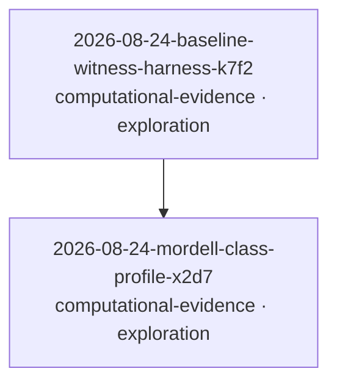

# Status — The Erdos-Straus conjecture

_Auto-generated by `scripts/build_graph.py`. Do not edit by hand._

**Problem status:** `open` · **Attempts:** 2 · 🔬 exploration: 2 · dead ends recorded: 0 · refutations: 0

## Attempt graph

## Attempts

| id | type | status | contributor | claim |
|---|---|---|---|---|
| [2026-08-24-baseline-witness-harness-k7f2](attempts/2026-08-24-baseline-witness-harness-k7f2/WRITEUP.md) | computational-evidence | 🔬 exploration | hybrid (claude-fable-5) | For every integer 2 <= n <= 100000 there exist positive integers x <= y <= z with 4/n = 1/x + 1/y + 1/z; a witness is produced for each n and re-verified via the exact integer identity 4xyz = n(xy + yz + zx). |
| [2026-08-24-mordell-class-profile-x2d7](attempts/2026-08-24-mordell-class-profile-x2d7/WRITEUP.md) | computational-evidence | 🔬 exploration | hybrid (claude-fable-5) | For all 714 integers n <= 100000 with n mod 840 in {1,121,169,289,361,529} (Mordell's exceptional classes), the minimal x > n/4 admitting a solution of 4/n = 1/x + 1/y + 1/z satisfies x - ceil(n/4) <= 7, with mean offset 0.853. |
